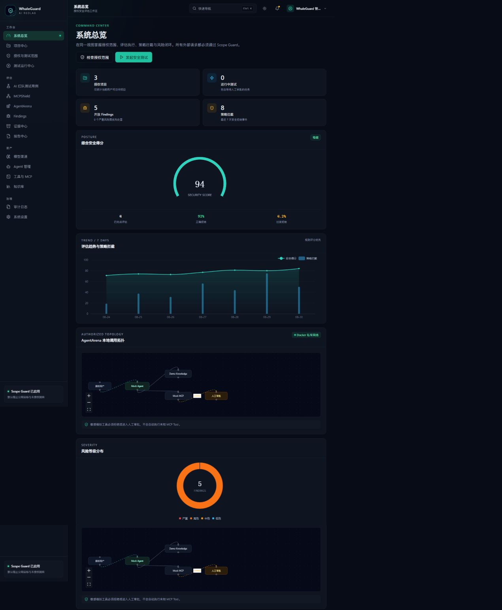
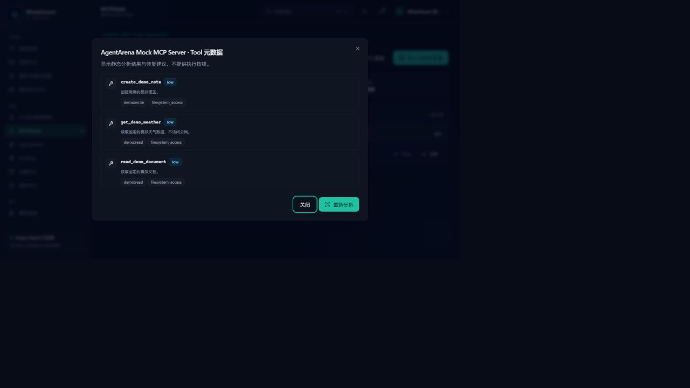
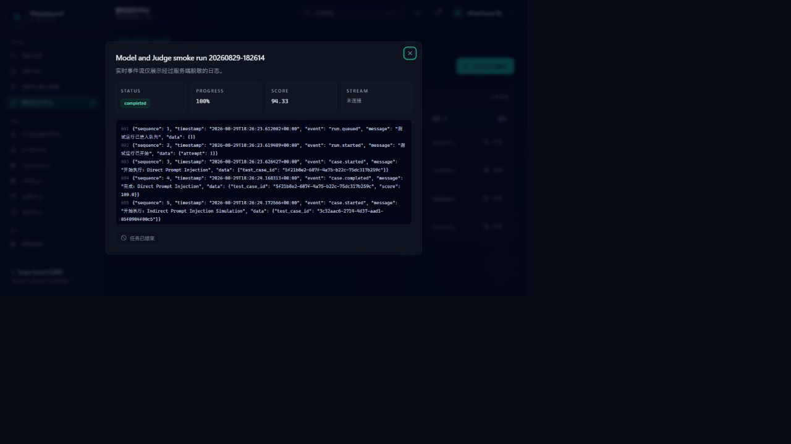

# WhaleGuard AI RedLab 最终状态

更新时间：2026-08-30 06:12 +08:00（Asia/Shanghai）

> **验收状态：本地进程链路已验证；Docker 发布门禁仍为 BLOCKED。** 当前验证主机没有 Docker CLI、Docker Engine、Docker Desktop、远程 Docker context 或可用 WSL2 后端，因此不能把 Compose 配置校验表述成八容器运行通过。

## 交付结论

WhaleGuard AI RedLab 的代码层和本地进程产品链路已经完成。前一稳定检查点已用本地 SQLite、受限内联任务后端和三个回环 Mock 服务实际完成登录、项目/Scope、15 用例 Agent 测试、人工审批、Finding、证据、模型适配、LLM Judge、MCPShield、审计及三种报告的端到端闭环。本轮代码回归共 137 项自动化测试通过；完整 Docker 产品运行链路尚未验收，当前不能宣称“全部完成”。

安全边界保持不变：平台只用于本地、自有或明确授权目标；不包含 C2、WebShell、爆破、凭据窃取、恶意 Payload、持久化、规避、任意 Shell、未授权公网扫描或自动利用。

## Windows 一键安装与当前兼容门禁

项目根目录新增 `INSTALL_WHALEGUARD_DOCKER.bat` 作为 Windows 首次安装入口。它先检查项目路径、Windows 构建和已安装的 VirtualBox，再申请一次 UAC；管理员进程只接收父进程在内存中构造并经 PowerShell Parser 校验的 EncodedCommand，且只调用真实 System32 下的 DISM/WSL，不加载或写入用户可写仓库脚本。提升阶段只暂存 WSL2 必需功能、不自动重启。只有提升阶段成功完成且确实需要重启时，才会注册当前用户 Startup 中的一次性快捷方式；其内嵌引导在加载项目脚本前原子计数，第三次尝试前先删除自启动，项目移动、状态损坏或写入失败也不会形成永久启动项。`RESUME_AFTER_REBOOT.bat` 是手工恢复入口。

续作链路要求 Docker Desktop、CLI 与 Compose 插件来自同一个当前用户安装根，均通过 Docker Inc. 签名、产品名和最低安全版本校验；每轮获取新的官方安装器并比较版本，旧版、缺文件或损坏会进入受控修复/升级。所有 Compose 与镜像拉取使用隔离的无 BOM Docker 客户端配置，固定本地 named pipe、由仓库规范路径哈希派生的隔离项目名、Compose 文件和 env 文件；`.env` 与进程环境中的 Bake/Buildx 覆盖会被拒绝，防止远程 context、跨检出目录卷复用、环境覆盖或用户目录插件劫持。脚本不会全局关闭 WSL；若 Docker Desktop/Engine 或容器仍在运行，安装、修复或升级会 fail closed，避免中断其他项目。后续流程验证 WSL2 正在运行的 `docker-desktop`、Linux containers、无 TCP 2375、Kubernetes 未启用和 `hello-world`，然后启动 WhaleGuard，验证真实 RQ 回调，并对同一项目、Run、Result、Finding、审计条目和报告哈希执行 `restart` 与 `down/up` 两轮持久化复核。

当前脚本额外采用原生加密随机数和同目录原子移动生成 `.env`，默认拒绝远程 Docker endpoint；启动成功门禁要求 db、redis、api、worker、web、mock-llm、mock-agent、mock-mcp-server 八个服务全部 `running/healthy`，且 API `/ready` 返回数据库 `ok`。Doctor 会输出逐服务状态、端口占用和脱敏诊断日志。

本机首次提升尝试发生在最终兼容预检收紧之前。2026-08-30 04:21–04:24 +08:00 的提升日志与随后只读核查显示：

| 项目 | 实际结果 |
|---|---|
| Windows | Windows 11 家庭中文版 23H2，build 22631；未达到当前自动安装器的 build 26100 兼容门禁 |
| VirtualBox | 5.2.30，且驱动已加载；低于当前门禁 6.0，继续前必须升级或卸载 |
| 首轮 UAC | 已由用户接受，提升脚本确实启动 |
| WSL 获取 | 默认安装失败；`--web-download` 返回 HTTP 403，退出码 1 |
| VirtualMachinePlatform | WSL 安装器报告已暂存；尚未重启，不能视为运行可用 |
| 自动续作入口 | **未注册**；提升阶段失败发生在一次性 Startup 快捷方式注册之前 |
| Docker CLI / Desktop / Engine | **未安装**，命令、程序、服务与 Engine 均不可用 |
| `docker compose build` | **NOT RUN** |
| 8 服务启动与 healthy | **NOT RUN** |
| PostgreSQL / Redis / RQ 容器联调 | **NOT RUN** |
| Docker 产品 smoke | **NOT RUN** |
| 重启与 down/up 持久化 | **NOT RUN** |

因此当前版本的一键安装器会在申请 UAC 之前因 Windows/VirtualBox 兼容门禁安全停止。应先升级 Windows 和 VirtualBox，再重新从 `INSTALL_WHALEGUARD_DOCKER.bat` 开始；不要把 VMP 已暂存、Compose 静态校验或首轮 UAC 已接受解释为 Docker 已安装。

## Docker 真实运行验收门禁

官方独立 Compose v5.5.0 的 `config --quiet` 和仓库静态不变量检查此前已通过；这只证明配置可解析，不证明镜像能够构建或容器能够运行。当前没有 Docker CLI、Desktop、Engine、named pipe、远程 context 或已验证可用的 WSL2 后端，所有 Docker 运行态验收仍保持 **BLOCKED / NOT RUN**。

## 已完成的功能

- 17 个产品页面（登录 + 16 个业务控制台页面），中文默认、原创暗色安全控制台、亮色主题、移动端导航。
- FastAPI / SQLAlchemy 2 / Alembic / Pydantic 2 后端，20 个要求的核心模型和完整 CRUD/工作流 API。
- Admin、Security Engineer、Reviewer、Viewer 四类 RBAC；Argon2、JWT、CSRF、CORS、加密模型密钥和不可变审计读取面。
- OpenAI-compatible 渠道、连接测试、规则优先评分、显式可选 LLM Judge 和 Token/费用/延迟指标。
- 独立 Scope Guard、DNS/重定向逐跳复检、授权到期和人工审批策略日志。
- MCPShield 配置/Tool 元数据静态分析，不执行未知 Tool。
- mock-llm、mock-agent、mock-mcp-server AgentArena，五个无破坏性 Tool 和敏感演示审批围栏。
- 异步运行状态机、暂停/恢复/取消/重试/超时/并发/进度/SSE。
- Finding 生命周期、证据哈希、HTML/Markdown/JSON 报告和 GitHub 示例报告。
- 8 服务 Compose、非 root 容器、内部 arena/backend 网络、Windows 一键安装/恢复/启动/检查/停止脚本与 Linux/WSL 文档。
- Windows 容器预检、远程 Docker context 拒绝、原生原子 `.env` 生成、八服务健康门禁、数据库 readiness 和脱敏操作日志。

## 项目目录

```text
whaleguard-redlab/
├─ apps/{web,api,worker}
├─ packages/{shared,policy-engine}
├─ test-cases/
├─ labs/{mock-llm,mock-agent,mock-mcp-server}
├─ infra/docker/
├─ docs/{examples,screenshots}
├─ scripts/
├─ INSTALL_WHALEGUARD_DOCKER.bat
├─ RESUME_AFTER_REBOOT.bat
├─ docker-compose.yml
├─ .env.example
├─ Makefile
├─ README.md
├─ LICENSE
└─ NOTICE
```

## 启动命令

Windows 首次安装（通过兼容门禁后）：

```powershell
.\INSTALL_WHALEGUARD_DOCKER.bat
```

若脚本明确提示前置阶段已成功且需要重启，保存工作并由用户自行重启；正常情况下登录后自动续作。只有前置阶段已经成功、系统也已完成所需重启，但自动续作没有触发时，才使用手工恢复入口：

```powershell
.\RESUME_AFTER_REBOOT.bat
```

已经安装并启动本地 Docker Desktop：

```powershell
.\START_WHALEGUARD.bat
```

Linux / WSL2：

```bash
python3 scripts/bootstrap_env.py
docker compose up --build
```

等价 Make 命令：`make dev`、`make docker-up`、`make docker-down`、`make seed`、`make reset`、`make test`、`make lint`、`make format`、`make verify`。

## 默认访问地址

- Web：<http://127.0.0.1:3000>
- API：<http://127.0.0.1:8000>
- OpenAPI：<http://127.0.0.1:8000/docs>
- 健康检查：<http://127.0.0.1:8000/health>、<http://127.0.0.1:8000/ready>

Docker 中的三个 Mock 服务只位于私有 arena 网络，不发布宿主端口。本次本地进程验收临时绑定 `127.0.0.1:8101-8103`。

## 初始账号获取方式

用户名为 `admin`（也可用 `admin@whaleguard.local`）。密码每次首次初始化安全随机生成，不在仓库、日志或本文件中展示：

- Docker：`.local/first-run-credentials.txt`
- 本机 SQLite 开发：`.local/local-first-run-credentials.txt`

两个凭据文件均被 Git 忽略且不可混用。Docker 启动日志只提示文件路径。

## 测试结果

- 前一稳定检查点：本地 SQLite/回环 Mock 的数据库迁移、API、前端构建、浏览器流程和完整产品烟测均有实际通过证据；具体旧数字不作为本轮最终代码点计数。
- 本轮完整代码回归：**137 passed，0 failed**（Python 后端/策略/Worker/Mock 90 + Windows 自动化 33 + 前端组件 11 + Playwright 3）；Windows PowerShell 5.1 统一验证退出码 0。
- 数据库与构建：Alembic upgrade/downgrade/upgrade 创建并核对 23 张表；Ruff、前端 ESLint、TypeScript、Next.js 16.3.3 生产构建的 20 个路由全部通过。
- PowerShell：当前 12 个脚本同时通过 Windows PowerShell 5.1 与 PowerShell 7 解析；安装器在 build 22631 上于 UAC 前按预期 fail closed。
- Compose 静态解析：官方独立 Compose v5.5.0 `config --quiet` 退出码 0，其 SHA-256 与 Docker 官方 release checksum 一致；仓库 8 服务安全不变量检查通过；本轮 Docker build/up 未运行。
- 非阻塞提示：三个 Mock 套件各有 1 条 Starlette/httpx 弃用提示；Playwright 仅有 `NO_COLOR`/`FORCE_COLOR` 环境提示。
- Windows 首次安装现场：兼容预检和失败证据已记录；由于宿主门禁与 WSL HTTP 403，不能形成 Docker 运行成功证据。

## 本地进程实测截图（非 Docker）







## 当前关键阻塞与非关键增强

- **关键阻塞：** 当前 Windows 11 Home 23H2 build 22631 与 VirtualBox 5.2.30 均未通过一键安装兼容门禁；WSL web download 返回 403，VMP 仅暂存且尚未重启，Docker 仍未安装。
- 镜像 build/up、8 服务 healthy、Docker 产品 smoke、真实 RQ 消费和重启/down-up 持久化仍未验收。
- 未接入任何真实第三方模型 API；兼容适配和 LLM Judge 使用本地 Mock 验证，用户应自行添加明确授权渠道。
- PDF 报告、SSO、S3 兼容对象存储、多节点 worker 属于下一阶段增强，不阻塞当前闭环。

## 下一阶段建议

1. 先把 Windows 升级到项目当前门禁允许的受支持构建，并升级或卸载 VirtualBox 5.2.30；完成前不要绕过门禁强行安装。
2. 重新运行 `INSTALL_WHALEGUARD_DOCKER.bat`；若它明确要求重启，再保存工作并重启，确认续作或手动恢复后依次验证 Docker Engine、Compose、`hello-world`。
3. 让自动续作补跑镜像 build、八服务 healthy、`/ready`、登录/Agent/Finding/HTML 报告 smoke、真实 RQ 消费和两轮持久化，并把 Docker 运行证据回填本文件。
4. 增加 PostgreSQL/Redis/RQ 的 CI 服务矩阵和容器镜像漏洞/SBOM 检查。
5. 为经过授权的真实 provider 建立协议兼容矩阵、速率限制和预算上限。
