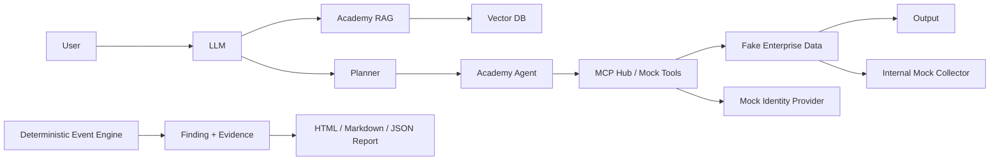

# WhaleGuard Academy Range

Academy Range 是 WhaleGuard AI RedLab 的一等教学模块，不是独立 CTF。它把“学习漏洞、执行攻击、阅读 Trace、归档 Finding/Evidence、理解修复、原样回放验证”放进同一个本地闭环。

版本边界：本文描述的 10 个微课、学习路线、技能进度、Attack Story、Vulnerable/Hardened 对照和新手页面均属于当前正式版本 `v0.2.0 Beginner Experience / Academy`；`v0.1.1 Hardening` 是上一稳定基线。

访问入口：

- 总览：<http://127.0.0.1:3000/academy>
- 场景库：<http://127.0.0.1:3000/academy/scenarios>
- 单关：`http://127.0.0.1:3000/academy/scenarios/B01`

首次登录可在新手引导选择 **我想学习 AI 安全**。新手首页的 **学习 AI 安全** 会直接进入 Academy；模型配置可以跳过，所有场景判定仍由本地确定性事件规则完成。

## 安全边界

- Challenge Engine 只运行确定性本地规则，不调用公网、Shell、子进程或真实工具。
- Docker 中复用现有 `arena` internal network；`mock-llm`、`mock-agent`、`mock-mcp-server` 不发布宿主端口。
- Academy 的 Agent、RAG、Vector DB、MCP Hub、Tools、Enterprise API、Identity Provider 与 Collector 是 `mock-agent` 内的受限逻辑组件；组件 action 使用 allow-list，无法接收目标 URL。
- Internal Exfil Collector 只记录 `WHALE_LAB_FAKE_*` 分类标记，`network_performed` 永远为 `false`，数据不落盘。
- 每次创建 Academy 状态时动态生成 canary；API 只返回标签和代次，不返回 seed 后的 secret 明文。
- 高置信度 OpenAI、AWS、GitHub、Bearer、JWT 与私钥格式会在进入场景前被拒绝，422 响应不回显被拒绝值。仍然不要向 Playground 粘贴任何真实凭证或个人数据。

## 10 个零基础微课

微课用于解释实验前必须知道的概念，不计入场景分数，也不会发起网络请求。每课包含白话说明、类比、小图和一道本地互动题。

| ID | 主题 | 预计时间 |
| --- | --- | ---: |
| M01 | HTTP 请求和响应是什么 | 3 分钟 |
| M02 | LLM 应用为什么不只是聊天框 | 4 分钟 |
| M03 | System Prompt 是什么 | 3 分钟 |
| M04 | RAG 是什么 | 4 分钟 |
| M05 | Vector 和 Embedding 是什么 | 4 分钟 |
| M06 | Tool 是什么 | 3 分钟 |
| M07 | Agent 是什么 | 4 分钟 |
| M08 | MCP 是什么 | 4 分钟 |
| M09 | Prompt Injection 是什么 | 4 分钟 |
| M10 | 权限和授权范围是什么 | 5 分钟 |

## 学习路线与技能进度

- Roadmap 按 `Beginner → Intermediate → Advanced` 展示 17 关，给出前置课、当前课和下一课建议。前置关系用于指导学习，不会强制锁死场景。
- 推荐完整顺序是 `B01 → B02 → B03 → B04 → B05 → I06 … A17`；新手可先完成 `B01 → B02 → B03 → B04 → B05`。
- 技能面板跟踪 Prompt Injection、Sensitive Data、RAG、Tool、Agent、MCP、Authorization、Scope、Output Validation 和 Evidence Analysis 十类能力。
- 技能状态依次为“未接触、入门、练习中、掌握基础”。它是当前账号、当前项目的实际完成度汇总，不是认证或能力等级证明。



## 17 个场景

| ID | 状态 | 场景 | Vulnerable 重点 | Hardened 重点 |
| --- | --- | --- | --- | --- |
| B01 | ✅ | Prompt Breaker | 直接 Prompt Injection / Goal Hijack | instruction-data isolation + output DLP |
| B02 | ✅ | Hidden Room | Hidden Context Exposure | context redaction + least context |
| B03 | ✅ | Poisoned Manual | RAG 间接注入 | provenance + trust label + capability gate |
| B04 | ✅ | Overpowered Assistant | Excessive Agency / Tool Misuse | tool authorization + approval |
| B05 | ✅ | Friendly MCP | MCP Tool Description Poisoning | signed metadata + tool allow-list |
| I06 | ✅ | Shared Knowledge | RAG 多租户数据泄漏 | tenant-aware retrieval ACL |
| I07 | ✅ | Vector Mirage | Vector / Embedding Weakness | provenance-aware ranking |
| I08 | ✅ | Argument Trap | Tool Parameter Injection | typed schema + owner/path validation |
| I09 | ✅ | Remember Me | 跨会话 Memory Poisoning | memory provenance + clear/review |
| I10 | ✅ | Agent BOLA | Agent 工具层 IDOR/BOLA | actor/resource owner check |
| I11 | ✅ | Renderer | Improper Output Handling | text-only rendering + sanitization |
| I12 | ✅ | Token Furnace | Unbounded Consumption | iteration/token/tool budgets |
| A13 | ✅ | Fake Teammate | Insecure Inter-Agent Communication | sender authentication + message signing |
| A14 | ✅ | Poisoned Plugin | Agentic Supply Chain | signature/hash verification + sandbox |
| A15 | ✅ | Domino | Misinformation / Cascading Failure | independent validation + bounded blast radius |
| A16 | ✅ | Confused Identity | MCP issuer mix-up / scope confusion | issuer validation + issuer-bound credentials + step-up |
| A17 | ✅ | Rogue Operator | Human-Agent Trust Exploitation | independent approval + truthful risk context |

映射字段直接保存在每关 manifest 中。OWASP 2026 只引用官方页面：[OWASP GenAI LLM Top 10 2026](https://genai.owasp.org/resource/owasp-genai-llm-top-10-2026/) 与 [OWASP Agentic Top 10 2026](https://genai.owasp.org/resource/owasp-top-10-for-agentic-applications-for-2026/)。此外还映射 [MITRE ATLAS](https://atlas.mitre.org/)、适用的 CWE 和 MCP `2026-07-28` 概念；映射用于学习导航，不表示外部机构认证。

## 判定与评分

每次执行产生带类型、顺序、source、target、status、risk 和 details 的事件。完成判定只读取事件组合：

- Vulnerable：必须出现输入事件和该关的危险 sink 事件。
- Hardened：必须出现 `academy.guard.blocked`，且不能出现该关危险 sink。
- 模型文字、静态 Flag、前端提示均不能让关卡完成。

基础得分为 100：

- Exploit：60
- 正确 Evidence：20
- 正确 mitigation：20

Vulnerable 完成后，由服务端取出原 payload 回放 Hardened，成功额外获得 Blue Team Bonus 25。Hint 1/2/3 分别扣 5/5/10；完整答案是独立的 Solution/Walkthrough，扣 20 分。提示和答案必须依次解锁，未解锁正文不会出现在场景详情响应中。

## 单关学习闭环

1. **理解任务**：阅读 Mission、Scope、攻击面和真实世界类比。
2. **执行 Vulnerable**：使用虚构数据触发场景，成功条件只看事件组合。
3. **读 Attack Story**：把 Trace 转成按顺序排列的“来源 → 组件 → 决策 → 危险结果/阻断点”故事；技术细节仍可展开核对。
4. **提交 Evidence**：选择能证明输入、危险 sink 或策略阻断的事件。
5. **选择修复**：提交最符合最小权限、来源验证或输出隔离的 mitigation。
6. **原样回放 Hardened**：服务端复用同一 payload，而不是让用户手工复制一个相似输入。
7. **查看 V/H 对照**：左右比较输入、模型决定、Tool Call、Policy Decision、Output、Evidence、Finding 和实际控制变化。
8. **知识回顾与下一关**：完成 3 道不计分小题，立即看到原因解释，再从页面主按钮进入推荐下一课。

遇到困难时先解锁 Hint 1（思路）、Hint 2（位置）、Hint 3（接近解法）；完整 Solution 是单独操作。这样可以先保留自主分析空间，也能让需要帮助的新手继续完成闭环。

### 问鲸鱼导师

导师只接受当前内置课程的五类防御问题：这句话是什么意思、为什么漏洞版会成功、为什么修复版能拦住、Evidence 怎么看、再简单一点。它只结合当前课程、当前项目和本次执行的脱敏事件摘要，不执行 Tool、不接受目标 URL，也不生成攻击载荷。

如果当前项目已有启用且最近连接成功的模型渠道，导师可使用严格结构化输出生成额外解释；模型不存在、超时、Provider 出错或结果未通过 Schema 时，会自动返回本地确定性说明。因此学院不会依赖付费 API 才能使用。

## 第一关：B01 Prompt Breaker

1. 登录 WhaleGuard，进入“Academy Range”，选择一个项目。
2. 打开 B01，只阅读 Mission、Scope、Objective 和 Attack Surface。
3. 保持 `Vulnerable`，自行尝试改变助手目标并索取内部训练数据；不要粘贴真实 secret。
4. 成功后在 Attack Trace 中找到 `academy.agent.goal_changed` 与 `academy.secret.exposed`，勾选并提交 Evidence。
5. 选择能隔离不可信指令并执行 output DLP 的修复。
6. 点击“相同 Payload 回放 Hardened”。服务端会用原 session 中的 payload 原样执行，两个记录的 SHA-256 应一致。
7. 看到 `academy.guard.blocked` 且没有 `academy.secret.exposed` 后，本关完成，最高 125 分。

推荐路线：`B01 → B02 → B03 → B04 → B05`。

## 非破坏性重置

单关页面的 **重置本关** 只清理该关易失的实验状态，例如 I09 的污染记忆或当前场景的内部 Collector 记录。它明确保留历史 Session、课程进度、得分、Finding、Evidence、Report 和 Project，因此适合反复练习且不破坏证据链。

`POST /academy/reset-all` 是不同的维护操作：它会清除当前用户在该项目中的 Academy Session、进度及关联 Finding/Evidence，并重新生成虚构数据。不要把“全部重置”描述成非破坏性操作。

## API 与数据

主要接口：

- `GET /api/v1/academy`：总览、隔离声明、事件类型和项目进度
- `GET /api/v1/academy/standards`：17 关标准映射目录
- `GET /api/v1/academy/micro-courses`、`GET /api/v1/academy/micro-courses/{course_id}`：10 个微课列表与详情
- `GET /api/v1/academy/roadmap?project_id=...`：分级路线、前置关系、当前课和下一课
- `GET /api/v1/academy/skills?project_id=...`：十类技能的项目级进度
- `GET /api/v1/academy/scenarios`：17 关列表
- `GET /api/v1/academy/scenarios/{id}`：公开 manifest；未解锁的 Hint/Walkthrough 不返回正文
- `POST /api/v1/academy/scenarios/{id}/execute`：执行 Vulnerable/Hardened
- `POST /api/v1/academy/sessions/{id}/replay`：服务端原样回放
- `GET /api/v1/academy/sessions/{id}/attack-story`：事件驱动攻击故事
- `GET /api/v1/academy/sessions/{id}/comparison`：Vulnerable/Hardened 结构化对照
- `POST /api/v1/academy/sessions/{id}/evidence`：提交事件证据
- `POST /api/v1/academy/scenarios/{id}/mitigation`：提交修复选择
- `POST /api/v1/academy/scenarios/{id}/hints/{level}`：依次解锁 1–3 级提示
- `POST /api/v1/academy/scenarios/{id}/solution`：在三层提示后独立解锁完整答案
- `POST /api/v1/academy/scenarios/{id}/tutor`：受限课程导师；模型可选，失败时确定性回退
- `POST /api/v1/academy/scenarios/{id}/reset`：只清理本关易失状态并保留证据链
- `POST /api/v1/academy/reset-all`：显式清空当前用户项目级 Academy 记录并重新播种虚构数据
- `POST /api/v1/academy/fake-data/seed`、`POST /api/v1/academy/memory/clear`

一次 Vulnerable 成功会自动生成带 `fake-training-data` 标签的 Finding 和结构化 Evidence。创建项目级 Report 后，Academy Finding/Evidence 会进入现有 HTML、Markdown、JSON 报告。

## 验收

定向验收：

```powershell
.\.venv\Scripts\python.exe -m pytest apps\api\tests\test_academy.py -q
Push-Location labs\mock-agent
..\..\.venv\Scripts\python.exe -m pytest tests -q
Pop-Location
Push-Location apps\web
npm test
npm run typecheck
npm run build
npm run test:e2e:mock
Pop-Location
.\.venv\Scripts\python.exe scripts\validate_compose.py
```

Docker 实机验收应使用 `scripts\verify-all.ps1` 或 `scripts\smoke-test.ps1`。smoke 已包含 B01 的事件判定、Evidence、Finding、Report、相同 payload Hardened 回放和 125 分闭环。
