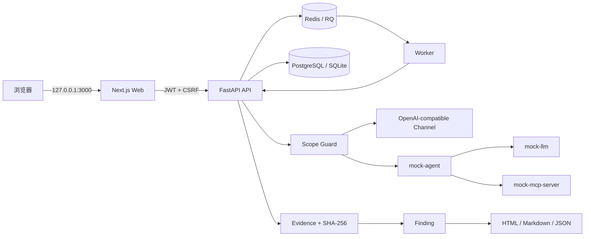

# 架构说明

WhaleGuard 采用前后端分离 monorepo。业务数据由 API 统一持久化，worker 只消费经过 API 校验并进入队列的测试任务；AgentArena 是不持有生产凭据的演示目标。

## 边界

- `edge` 网络承载 Web/API 与宿主机访问，端口只绑定 `127.0.0.1`。
- `backend` 是 Docker `internal` 网络，仅连接 PostgreSQL、Redis、API 和 worker。
- `arena` 是 Docker `internal` 网络，三个 Mock 服务没有宿主机端口。
- API 是连接 `edge`、`backend`、`arena` 三个隔离区的唯一桥接服务。
- API 是唯一允许向授权模型渠道发请求的组件，所有请求先进入 Scope Guard。
- 未知 MCP Tool 从不由 MCPShield 执行；第一版只分析 JSON 配置和元数据。
- AuditLog 只允许服务端追加，普通用户没有修改或删除接口。

## 扩展点

- 新模型提供方：实现 OpenAI-compatible channel 配置或新增 adapter。
- 新测试：添加符合 `packages/shared/schemas/test-case.schema.json` 的 YAML/JSON。
- 新 evaluator：实现 worker 的确定性 evaluator，并登记指标和评分解释。
- 新报告格式：从标准化 Finding/Evidence DTO 渲染，不直接拼接不可信 HTML。
