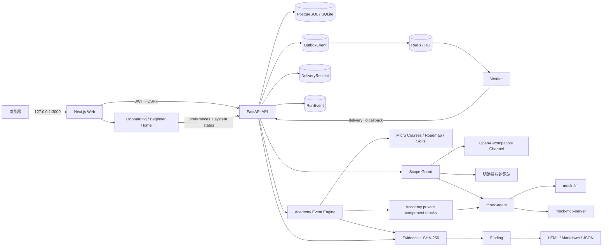

# 架构说明

WhaleGuard 采用前后端分离 monorepo。业务数据由 API 统一持久化，worker 只消费经过 API 校验并进入队列的测试任务；AgentArena 是不持有生产凭据的演示目标。

`v0.2.0 Beginner Experience / Academy` 是当前正式架构版本，`v0.1.1 Hardening` 是上一稳定基线。以下新手引导、学习层和网站体检编排均属于 v0.2.0；实际部署状态仍以当前实例的 health/readiness 与数据库迁移结果为准。

## Beginner Experience

- 新手引导是 Web 中的四步真实流程：目标选择、系统检查、模型选择、开始使用。选择结果由 `GET/PATCH /api/v1/auth/preferences` 按用户持久化。
- 新手首页只暴露三条主要路径：学习 AI 安全、检查我的网站、查看已有结果；高级模式仍保留完整控制台。模式切换不改变 RBAC、Scope Guard、审批或审计。
- `GET /api/v1/system/status` 聚合数据库、Redis、worker、三个本地 Mock 和可选模型渠道状态。没有模型是 `optional`，Academy 与规则体检仍可工作。
- Web 页面只呈现状态；API 仍是权限、持久化和外部请求的唯一可信边界。

## 边界

- `edge` 网络承载 Web/API 与宿主机访问，端口只绑定 `127.0.0.1`。
- `backend` 是 Docker `internal` 网络，仅连接 PostgreSQL、Redis、API 和 worker。
- `arena` 是 Docker `internal` 网络，三个 Mock 服务没有宿主机端口。
- Academy 的八个目标是 `mock-agent` 内的 allow-list 逻辑组件；Challenge Engine 自身不发网络请求，Internal Collector 不落盘且只接受 `WHALE_LAB_FAKE_*` 标记。
- API 是连接 `edge`、`backend`、`arena` 三个隔离区的唯一桥接服务。
- API 是唯一允许向授权模型渠道发请求的组件，所有请求先进入 Scope Guard。
- 未知 MCP Tool 从不由 MCPShield 执行；第一版只分析 JSON 配置和元数据。
- AuditLog 只允许服务端追加，普通用户没有修改或删除接口。

## 网站体检数据流

1. Web 提交精确 HTTP/HTTPS URL、明确授权确认和固定 `safe_read_only` 等级；模型渠道可为空。
2. API 在未提供 `project_id` 时，按权限复用或创建当前用户的“我的网站体检”项目。
3. API 创建或续期 24 小时精确 URL Scope。匹配包含 scheme、规范化 host、有效端口、原始 path、query 和 fragment；网站向导本身拒绝凭据、query、fragment 与歧义路径。
4. 被动扫描器通过 Scope Guard 发出一条有大小上限的只读 GET，不跟随重定向；规则检查不需要 API Key。
5. API 只保存脱敏 HTTP 观察、规则检查、哈希、Finding 与可选报告，不保存响应正文、Cookie 名称/值或目标凭据。
6. 若选择模型渠道，只把脱敏规则摘要发送给精确授权的 `/chat/completions` 端点。模型解释不能修改规则分数或证据。
7. AI 失败时，`POST /website-scans/{id}/ai-analysis` 只复用已保存规则结果重新请求模型，不再次访问目标网站。

网站体检目前是同步、低风险的一次性流程。读取历史时，超过五分钟仍停留在 `running` 的中断记录会被安全收敛为 `failed`，避免留下永久运行状态。

## Academy 学习层

- 10 个 Micro Course 是静态、只读的概念内容；Roadmap 和 Skills 从当前用户、当前项目的 `AcademyProgress` 动态计算。
- 17 个场景继续由确定性 Event Engine 执行。模型文本、前端按钮或静态 Flag 不能直接完成关卡。
- Hint 1–3 与独立 Solution 由服务端按顺序解锁并计入扣分，未解锁正文不进入公开 manifest。
- Attack Story 把已保存事件投影为可读时间线；Comparison 把 Vulnerable 与 Hardened 的输入、决定、工具、策略、输出和证据做结构化 A/B 对照。这两个读取接口都不会触发新的执行。
- 单关 reset 仅清理该场景的易失内存/Collector 状态，保留 Session、进度、Finding、Evidence、Report 和 Project；`reset-all` 才是显式删除项目内当前用户 Academy 记录的维护动作。
- 鲸鱼导师只接收五类课程防御意图和 allow-list 事件类型摘要；有合格模型渠道时通过现有 Scope Guard/模型适配层生成严格结构化解释，否则返回本地确定性说明。它不接收 payload、完整 Evidence、凭据、目标 URL 或 Tool 调用。

## 可靠投递与事件一致性

每条 `TestResult` 先独立持久化；全部用例完成后，Run 完成状态、对应这些结果的 Outbox intents 与 `run.completed` 事件在同一个数据库事务中提交。Outbox 通过外键绑定所属 Run 并在删除时级联清理；dispatcher 在入队前还会拒绝异常孤儿记录。事务提交后才把复核作业交给 RQ；Redis 暂时不可用时事件保持 `pending`，按有界退避重试。Worker 对 API/DNS/限流/5xx 执行 6 次原地尝试，累计退避 25 秒且每次请求超时 10 秒，超限后再由 RQ Retry 兜底。

每个 Outbox 记录使用自身 UUID 作为稳定 `delivery_id`。Worker 重试时原样回传；API 只接受该 Run 已签发且已投递的 ID，并在锁定 `TestRun` 行后，以数据库唯一约束 `(run_id, delivery_id)` 写入 `DeliveryReceipt`。同一内容的重复回调返回成功但不重复修改评分或事件；同一 ID 携带不同业务内容返回 `409` 并留下拒绝审计。进程内锁只用于 SQLite 开发模式优化，PostgreSQL 行锁、外键和唯一约束才是生产一致性边界。

运行事件的权威来源是 `RunEvent`，并以 `(run_id, sequence)` 唯一约束保持顺序。SSE 与游标分页均读取该表；事件载荷递归脱敏且限制为 64 KiB。旧 `TestRun.event_log` 仅作为 deprecated API 兼容视图保留，迁移会把已有历史回填到规范化事件表。

## 扩展点

- 新模型提供方：实现 OpenAI-compatible channel 配置或新增 adapter。
- 新测试：添加符合 `packages/shared/schemas/test-case.schema.json` 的 YAML/JSON。
- 新 evaluator：实现 worker 的确定性 evaluator，并登记指标和评分解释。
- 新报告格式：从标准化 Finding/Evidence DTO 渲染，不直接拼接不可信 HTML。
