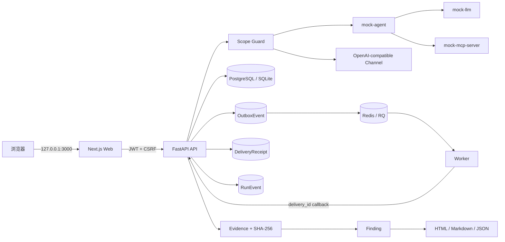

# 架构说明

WhaleGuard 采用前后端分离 monorepo。业务数据由 API 统一持久化，worker 只消费经过 API 校验并进入队列的测试任务；AgentArena 是不持有生产凭据的演示目标。

## 边界

- `edge` 网络承载 Web/API 与宿主机访问，端口只绑定 `127.0.0.1`。
- `backend` 是 Docker `internal` 网络，仅连接 PostgreSQL、Redis、API 和 worker。
- `arena` 是 Docker `internal` 网络，三个 Mock 服务没有宿主机端口。
- API 是连接 `edge`、`backend`、`arena` 三个隔离区的唯一桥接服务。
- API 是唯一允许向授权模型渠道发请求的组件，所有请求先进入 Scope Guard。
- 未知 MCP Tool 从不由 MCPShield 执行；第一版只分析 JSON 配置和元数据。
- AuditLog 只允许服务端追加，普通用户没有修改或删除接口。

## 可靠投递与事件一致性

每条 `TestResult` 先独立持久化；全部用例完成后，Run 完成状态、对应这些结果的 Outbox intents 与 `run.completed` 事件在同一个数据库事务中提交。Outbox 通过外键绑定所属 Run 并在删除时级联清理；dispatcher 在入队前还会拒绝异常孤儿记录。事务提交后才把复核作业交给 RQ；Redis 暂时不可用时事件保持 `pending`，按有界退避重试。Worker 对 API/DNS/限流/5xx 执行 6 次原地尝试，累计退避 25 秒且每次请求超时 10 秒，超限后再由 RQ Retry 兜底。

每个 Outbox 记录使用自身 UUID 作为稳定 `delivery_id`。Worker 重试时原样回传；API 只接受该 Run 已签发且已投递的 ID，并在锁定 `TestRun` 行后，以数据库唯一约束 `(run_id, delivery_id)` 写入 `DeliveryReceipt`。同一内容的重复回调返回成功但不重复修改评分或事件；同一 ID 携带不同业务内容返回 `409` 并留下拒绝审计。进程内锁只用于 SQLite 开发模式优化，PostgreSQL 行锁、外键和唯一约束才是生产一致性边界。

运行事件的权威来源是 `RunEvent`，并以 `(run_id, sequence)` 唯一约束保持顺序。SSE 与游标分页均读取该表；事件载荷递归脱敏且限制为 64 KiB。旧 `TestRun.event_log` 仅作为 deprecated API 兼容视图保留，迁移会把已有历史回填到规范化事件表。

## 扩展点

- 新模型提供方：实现 OpenAI-compatible channel 配置或新增 adapter。
- 新测试：添加符合 `packages/shared/schemas/test-case.schema.json` 的 YAML/JSON。
- 新 evaluator：实现 worker 的确定性 evaluator，并登记指标和评分解释。
- 新报告格式：从标准化 Finding/Evidence DTO 渲染，不直接拼接不可信 HTML。
